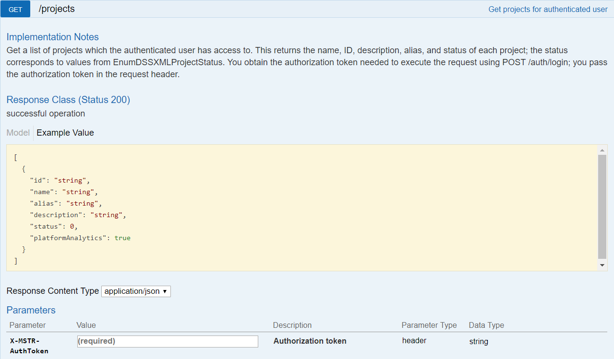
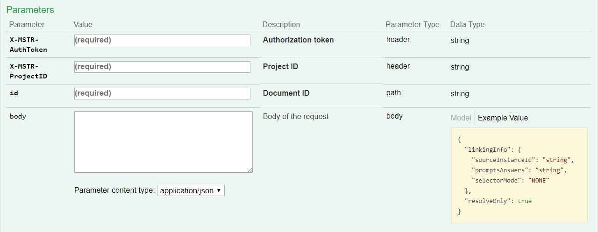
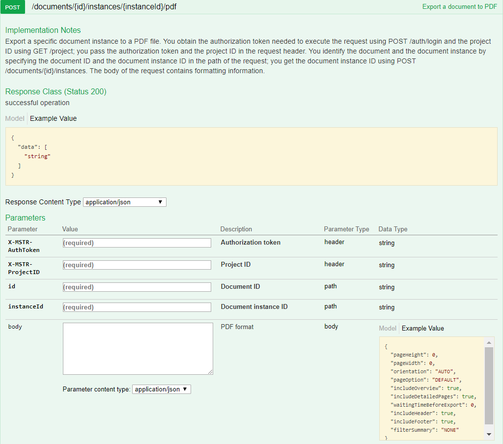
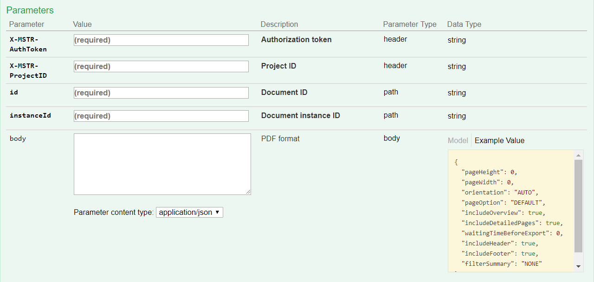

:::tip

You can try out this workflow at [REST API Playground](https://www.postman.com/microstrategysdk/workspace/microstrategy-rest-api/folder/16131298-3835f147-fc3e-4e94-bc73-af51f57f7e83?ctx=documentation).

Learn more about MicroStrategy REST API Playground [here](/docs/getting-started/playground.md).

:::

The workflow for exporting a document to PDF includes the following sequence of REST API requests.

1. [Log in](#log-in) User authenticates into the environment with `POST /api/auth/login` and standard authentication
1. [Get project list](#get-project-list) User obtains the project list from `GET /api/projects`
1. [Create a document instance](#create-a-document-instance) User executes a specific document in a specific project and creates a document instance
1. [Export a document to PDF](#export-a-document-to-pdf) User exports the document to a PDF file
1. [Log out](#log-out) User calls `POST /api/logout` to close the session

A detailed explanation of each step is provided below:

## Log In

End Point: `POST /api/auth/login`

This endpoint allows the caller to authenticate with the MicroStrategy REST Server. You provide the information used to create the session in the body of the request. In this example, you use standard authentication so you need to provide username, password, and loginMode (which specifies the authentication mode to use). If you omit an optional field, the REST Server uses the default value. If the call is successful, the resulting HTTP response returns an HTTP status code 204 and a response header containing `X-MSTR-AuthToken`, the authorization token that will be used in subsequent requests.


REST API Explorer: [https://demo.microstrategy.com/MicroStrategyLibrary/api-docs/#!/Authentication/postLogin](https://demo.microstrategy.com/MicroStrategyLibrary/api-docs/#!/Authentication/postLogin)

Sample Request

- Request Headers

  ```http
  'Content-Type: application/json'
  'Accept: application/json'
  ```

- Request Body

  ```json
  {
    "loginMode": 1,
    "username": "administrator",
    "password": ""
  }
  ```

- Curl

  ```bash
  curl -X POST -i -c ~/cookie-jar.txt --header 'Content-Type: application/json' --header 'Accept: application/json' -d '{ \
  "loginMode":1, \
  "username": "administrator", \
  "password": "" \
  }' https://demo.microstrategy.com/MicroStrategyLibrary/api/auth/login'
  ```

Sample Response

- Response Headers

  ```json
  {
    "pragma": "no-cache",
    "x-mstr-authtoken": "nllmm5lpmkjdsj4d4etgdikc6c",
    "cache-control": "no-cache, no-store, max-age=0, must-revalidate",
    "date": "Wed, 16 Aug 2017 01:42:31 GMT",
    "expires": "0",
    "content-type": null
  }
  ```

  The authorization token `"x-mstr-authtoken"` is returned in the response header. It is used in other endpoints to authenticate the user.

- Response Body: Empty

- Response Code: 204 (Success: No Content)

## Get project list

End Point: `GET /api/projects`

This endpoint allows the caller to get the list of projects with the MicroStrategy REST Server. In this example, you get the list of projects in the MicroStrategy Tutorial metadata. You use the authorization token returned during login as the value for `X-MSTR-AuthToken`. If the call is successful, the resulting HTTP response returns an HTTP status code 200 and a response body containing a list of the active projects that the user session has access to.



REST API Explorer: [https://demo.microstrategy.com/MicroStrategyLibrary/api-docs/index.html#!/Projects/getProjects](https://demo.microstrategy.com/MicroStrategyLibrary/api-docs/index.html#!/Projects/getProjects)

Sample Request

- Request Headers

  ```http
  'Accept: application/json'
  'X-MSTR-AuthToken: nllmm5lpmkjdsj4d4etgdikc6c'
  ```

- Request Body: Empty

- Curl

  ```bash
  curl -X GET -b ~/cookie-jar.txt --header 'Accept: application/json' --header 'X-MSTR-AuthToken: nllmm5lpmkjdsj4d4etgdikc6c'  https://demo.microstrategy.com/MicroStrategyLibrary/api/projects'
  ```

Sample Response

- Response Body

  ```json
  [
    {
      "id": "B19DEDCC11D4E0EFC000EB9495D0F44F",
      "name": "MicroStrategy Tutorial",
      "alias": "",
      "description": "MicroStrategy Tutorial project and application set designed to illustrate the platform's rich functionality. The theme is an Electronics, Books, Movies and Music store. Employees, Inventory, Finance, Product Sales and Suppliers are analyzed.",
      "status": 0
    },
    {
      "id": "AF09B3E3458F78B4FBE4DEB68528BF7B",
      "name": "Human Resources Analysis Module",
      "alias": "",
      "description": "The Human Resources Analysis Module analyses workforce headcount, trends and profiles, employee attrition and recruitment, compensation and benefit costs and employee qualifications, performance and satisfaction.",
      "status": 0
    }
  ]
  ```

  The response body contains information for each project that is returned, including the project ID that you use in later endpoints.

## Create a document instance

End Point: `POST /api/documents/{id}/instances`

This endpoint allows the caller to execute a specific document in a specific project and create an instance of that document. In this example, you execute a document called "Casino Analysis" (located in MicroStrategy Tutorial>Shared Reports>MicroStrategy Platform Capabilities>MicroStrategy Report Services>Visual Insight). You use the authorization token returned in step 1 as the value for `X-MSTR-AuthToken` and provide the project ID and the document ID. In this example, you leave the request body empty. The resulting HTTP response returns an HTTP status 201 and a JSON object containing the instance ID ("mid") of the document.


REST API Explorer: [https://demo.microstrategy.com/MicroStrategyLibrary/api-docs/#!/Dossiers_and_Documents/createDocumentInstance](https://demo.microstrategy.com/MicroStrategyLibrary/api-docs/#!/Dossiers_and_Documents/createDocumentInstance)

Sample Request

- Request Parameters

  

- Request Headers

  ```http
  'Accept: application/json'
  'X-MSTR-AuthToken: nllmm5lpmkjdsj4d4etgdikc6c'
  'X-MSTR-ProjectID: B19DEDCC11D4E0EFC000EB9495D0F44F'
  ```

- Request Body: Empty

- Curl

  ```bash
  curl -X POST -i -c ~/cookie-jar.txt --header 'Content-Type: application/json' --header 'Accept: application/json' --header 'X-MSTR-AuthToken: nllmm5lpmkjdsj4d4etgdikc6c' --header 'X-MSTR-ProjectID: B19DEDCC11D4E0EFC000EB9495D0F44F' -d '{}' 'http://demo.microstrategy.com/MicroStrategyLibrary/335FFA9640B5F1C1E0C0F3A469E627A8/instances'
  ```

Sample Response

- Response Body

  The REST server returns the instance ID of the document as the value of "mid".

  ```json
  {
    "status": 0,
    "mid": "0ADDDAF34260EBA5D5FB73BFE5852AC3"
  }
  ```

  You can find the detailed parameter definitions in the Response Body on the Swagger page under Response Class -> Model.

- Response Code: 201 (Success: Created)

## Export a document to PDF

End Point: `POST /api/documents/{id}/instances/{instanceId}/pdf`

This endpoint allows the caller to export the document to a PDF file (in the form of binary data with Base64 encoding) using the instance ID and object ID of the document. In this example, you export the document to a PDF file using the instance ID you created in the previous step. You provide the authorization token generated during login and the project ID in the request header, and the document ID and the instance ID of the document in the request path. In the request body, you specify in JSON how to format the PDF file that you are exporting. If the call is successful, the resulting HTTP response returns a response body in either `application/json` or `application/octet-stream` format, depending on the Response Content Type you choose. If you choose `application/octet-stream` format, the data will be returned in PDF format; if you choose a`pplication/json`, the data will be returned as Base64-encoded binary data and you will have to decode it. You can [download sample Java code](https://www2.microstrategy.com/producthelp/2021/downloads/RESTSDK/ConvertToPDF.zip) that converts the output of the endpoint to a PDF file.



REST API Explorer: [https://demo.microstrategy.com/MicroStrategyLibrary/api-docs/index.html#!/Dossiers_and_Documents/exportDashboardToPDF](https://demo.microstrategy.com/MicroStrategyLibrary/api-docs/index.html#!/Dossiers_and_Documents/exportDashboardToPDF)

Sample Request

- Request Parameters

  

- Request Headers

  ```http
  'Accept: application/json'
  'X-MSTR-AuthToken: nllmm5lpmkjdsj4d4etgdikc6c'
  'X-MSTR-ProjectID: B19DEDCC11D4E0EFC000EB9495D0F44F'
  ```

- Request Body:

  ```json
  {
    "pageHeight": 11.69,
    "pageWidth": 8.27,
    "orientation": "AUTO",
    "pageOption": "ALL",
    "includeOverview": true,
    "includeDetailedPages": true,
    "waitingTimeBeforeExport": 0,
    "includeHeader": true,
    "includeFooter": true
  }
  ```

  In the request body above, you specify the formatting options:

  - You set the page height to be 11.69 inches and the page width to be 8.27 inches, which is the size of A4 paper.
  - You set the exporting orientation to "AUTO", which means that the height and width of the PDF can be swapped to optimize exporting.
  - You set the `pageOption` to ALL, which means that you want to export all of the pages of the document.
  - You set `includeOverview` to specify that you want the exported PDF to have an overview of the document.
  - You set `includeDetailedPages` to specify that you want each visualization printed on an individual page.
  - You set `includeHeader` to specify that you want the header to be printed on each page.
  - You set `includeFooter` to specify that you want the footer to be printed on each page.
  - You set the `waitingTimeBefore Export` to "0" second to specify that export the document immediately.

- Curl

  ```bash
  curl -X POST -i -c ~/cookie-jar.txt --header 'Content-Type: application/json' --header 'Accept: application/json' --header 'X-MSTR-AuthToken: nllmm5lpmkjdsj4d4etgdikc6c' --header 'X-MSTR-ProjectID: B19DEDCC11D4E0EFC000EB9495D0F44F' -d '{}' 'https://demo.microstrategy.com/MicroStrategyLibrary/api/documents/335FFA9640B5F1C1E0C0F3A469E627A8/instances/0ADDDAF34260EBA5D5FB73BFE5852AC3/pdf'
  ```

Sample Response

- Response Body

  The REST server returns a JSON object containing the "data" property which includes the PDF data in Base64-encoded binary. A sample Base64-encoded binary data file for the document can be viewed in the [data.txt](https://www2.microstrategy.com/producthelp/2021/downloads/RESTSDK/RESTAPIs/data.txt) file. A sample PDF file for the document can be viewed in the [output.pdf](https://www2.microstrategy.com/producthelp/2021/downloads/RESTSDK/RESTAPIs/output.pdf) file.

  ```json
  {
    "data": "JVBERi0xL..."
  }
  ```

  You can find the detailed parameter definitions in the Response Body on the Swagger page under Response Class -> Model.

- Response Code: 200 (Success: OK)

## Log out

End Point: `POST /api/auth/logout`

This endpoint allows the caller to log out for the authenticated user with the MicroStrategy REST Server. In this example, you close the active user session by providing the authorization token, `X-MSTR-AuthToken`, generated during login. If the call is successful, the resulting HTTP response returns an HTTP status code 204.


REST API Explorer: [https://demo.microstrategy.com/MicroStrategyLibrary/api-docs/#!/Authentication/postLogout](https://demo.microstrategy.com/MicroStrategyLibrary/api-docs/#!/Authentication/postLogout)

Sample Request

- Request Headers

  ```http
  'Accept: application/json'
  'X-MSTR-AuthToken: nllmm5lpmkjdsj4d4etgdikc6c'
  ```

- Request Body: Empty

- Curl

  ```bash
  curl -X POST -i -c ~/cookie-jar.txt --header 'Content-Type: application/json' --header 'Accept: application/json' --header 'X-MSTR-AuthToken: nllmm5lpmkjdsj4d4etgdikc6c'  https://demo.microstrategy.com/MicroStrategyLibrary/api/auth/logout'
  ```

Sample Response

- Response code: 204
