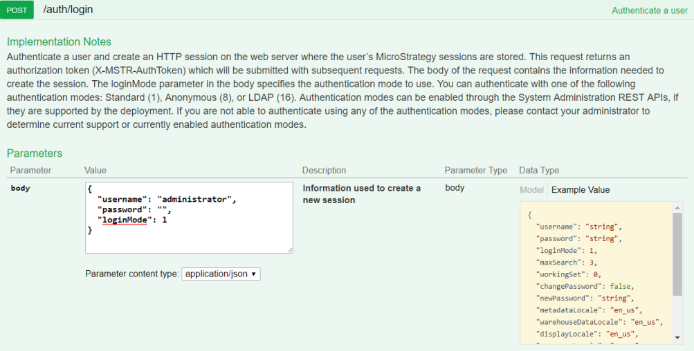
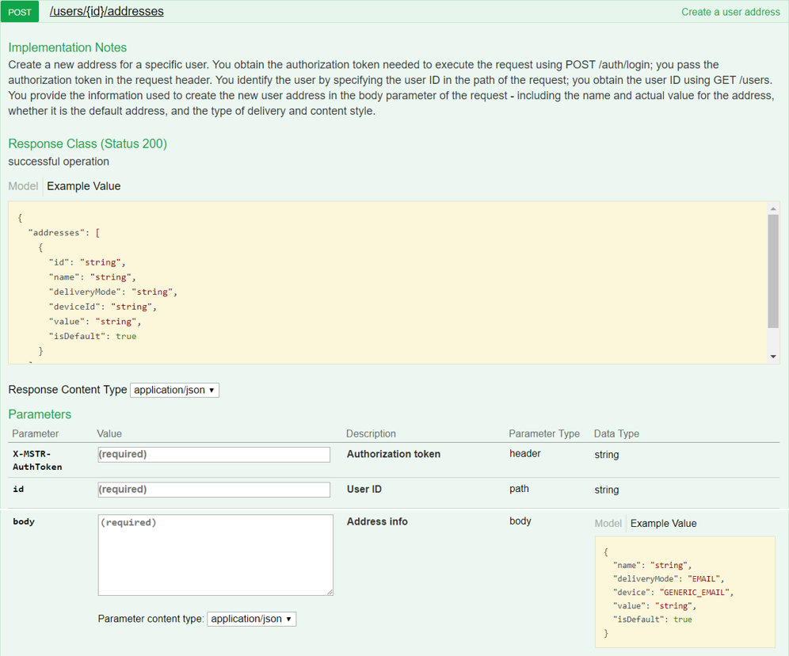

:::tip

You can try out this workflow at [REST API Playground](https://www.postman.com/microstrategysdk/workspace/microstrategy-rest-api/folder/16131298-be8db67e-6743-49ef-beb5-9efb96e01e4b?ctx=documentation).

Learn more about MicroStrategy REST API Playground [here](/docs/getting-started/playground.md).

:::

A workflow sample for creating a new user, a process often called onboarding, is provided below. The following sequence of REST API requests allows an administrative user to create a new user, update the user information, create an email address for the user, and send the new user a welcome email.

1. [Log in](#log-in) Admin user calls `POST /api/auth/login` to authenticate into the environment.
1. [Create a new user](#create-a-new-user) Admin user calls `POST /api/users` to create a new user.
1. [Assign the user to a user group](#assign-the-user-to-a-user-group) Admin user calls `PATCH /api/users/{id}` to update information for the new user.
1. [Create an email address for the new user](#create-an-email-address-for-the-new-user) Admin user calls `POST /api/users/{id}/addresses` to create an email address for the new user.
1. [Send a welcome email to the new user](#send-a-welcome-email-to-the-new-user) Admin user calls `POST /api/emails` to send a welcome email to the new user.
1. [Log out](#log-out) Admin user calls `POST /api/logout` to close the session.

To make it easy for you to test this workflow in your environment, [download the zipped Postman script](https://www2.microstrategy.com/producthelp/2021/downloads/RESTSDK/PostmanScripts/OnboardingUsers_postman_collection.zip) provided for you, extract the JSON file, and configure it to point to your Web server.

A detailed explanation of each step is provided below:

## Log in

End Point: `POST /api/auth/login`

This endpoint allows the caller to authenticate with the MicroStrategy REST Server. You provide the information used to create the session in the body of the request. In this example, you use standard authentication so you need to provide username, password, and loginMode (which specifies the authentication mode to use). If you omit an optional field, the REST Server uses the default value. If the call is successful, the resulting HTTP response returns a status code 204 and a response header containing X-MSTR-AuthToken, the authorization token that will be used by subsequent requests.



REST API Explorer: [https://demo.microstrategy.com/MicroStrategyLibrary/api-docs/#!/Authentication/postLogin](https://demo.microstrategy.com/MicroStrategyLibrary/api-docs/#!/Authentication/postLogin)

Sample Request

- Request Headers

  ```http
  'Content-Type: application/json'
  'Accept: application/json'
  ```

- Request Body

  ```json
  {
    "loginMode": 1,
    "username": "administrator",
    "password": ""
  }
  ```

- Curl

  ```bash
  curl -X POST -i -c --header 'Content-Type: application/json' --header 'Accept: application/json' -d '{ \
    "loginMode":1, \
    "username": "administrator", \
    "password": "" \
  }' https://demo.microstrategy.com/MicroStrategyLibrary/api/auth/login'
  ```

Sample Response

- Response Headers

  The authorization token `"x-mstr-authtoken"` is returned in the response header. It is used by other endpoints to authenticate the caller.

  ```json
  {
    "pragma": "no-cache",
    "x-mstr-authtoken": "nllmm5lpmkjdsj4d4etgdikc6c",
    "cache-control": "no-cache, no-store, max-age=0, must-revalidate",
    "date": "Wed, 22 Aug 2018 01:42:31 GMT",
    "expires": "0",
    "content-type": null
  }
  ```

  - Response Body: Empty

  - Response Code: 204 (Success: No Content)

## Create a New User

End Point: `POST /api/users`

This endpoint allows the caller to create a new user. You obtain the authorization token needed to execute the request using `POST /api/auth/login`; you pass the authorization token in the request header. You provide the information to create the user in the body parameter of the request. The response includes the user ID, which other endpoints use as a request parameter to specify which user to perform an action on. In this example, you create a new user called "John Smith", who is automatically a member of the "Everyone" user group. Initially, you do not assign the new user to any other user group.


REST API Explorer: [https://demo.microstrategy.com/MicroStrategyLibrary/api-docs/index.html#!/User_Management/createUser](https://demo.microstrategy.com/MicroStrategyLibrary/api-docs/index.html#!/User_Management/createUser)

Sample Request

- Request Parameters

  - **X-MSTR-AuthToken** Authorization token generated by `POST /api/auth/login`, required to authenticate caller
  - **body** Information used to create the user, including the `username`, `fullname`, and `description` of the user, password and authentication information, and the IDs of the user groups the user belongs to (`memberships`).

- Request Headers

  ```http
  'Accept: application/json'
  'X-MSTR-AuthToken: nllmm5lpmkjdsj4d4etgdikc6c'
  ```

- Request Body

  ```json
  {
    "username": "Jsmith",
    "fullName": "John Smith",
    "description": "Senior Software Engineer",
    "password": "J$mith!23",
    "enabled": "true",
    "passwordModifiable": "true",
    "requireNewPassword": "true",
    "standardAuth": "true"
  }
  ```

- Curl

  ```bash
  curl -X POST --header 'Content-Type: application/json' --header 'Accept: application/json' --header 'X-MSTR-AuthToken: nllmm5lpmkjdsj4d4etgdikc6c' -d '{
    "username":"Jsmith",
    "fullName":"John Smith",
    "description: "Senior Software Engineer",
    "password: "J$mith!23",
    "enabled: "true",
    "passwordModifiable: "true",
    "requireNewPassword: "true",
    "standardAuth: "true"
  }' 'http://localhost:8282/consume-dev/api/users'
  ```

Sample Response

- Response Body

  The response body contains information about the user that was created, including the user ID that will be used by later endpoints to identify the user.

  ```json
  {
    "name": "John Smith",
    "id": "8D0C05F2456F52E4AA737891B4659201",
    "type": "34",
    "abbreviation": "Jsmith",
    "description": "Senior Software Engineer",
    "subtype": 8704,
    "extType": 0,
    "dateCreated": "2018-08-22T19:53:01.000+0000",
    "dateModified": "2018-08-22T19:53:02.000+0000",
    "version": "A1C05E854CDF709E247799A9CFEF2635",
    "acg": "255",
    "owner": {
      "name": "Administrator",
      "id": "54F3D26011D2896560009A8E67019608"
    },
    "ancestors": [
      {
        "name": "CASTOR_SERVER_CONFIGURATION",
        "id": "3A22AF3611E8A63CFA170080EF35139A",
        "level": 2
      }
    ],
    "acl": [],
    "username": "Jsmith",
    "fullName": "John Smith",
    "enabled": "true",
    "passwordModifiable": "true",
    "requireNewPassword": "true",
    "standardAuth": "true",
    "memberships": [
      {
        "id": "C82C6B1011D2894CC0009D9F29718E4F",
        "name": "Everyone"
      }
    ],
    "initials": "JS"
  }
  ```

- Response Code: 201 (Created Successfully)

## Assign the user to a user group

End Point: `PATCH /api/users/{id}`

This endpoint allows the caller to update specific information for a specific user. You obtain the authorization token needed to execute the request using `POST /api/auth/login`; you pass the authorization token in the request header. You identify the user by specifying the user ID in the path of the request; you obtain the user ID while creating a new user using `POST /api/users` (as you did in the previous step) or using `GET /api/users` for previously created users. You specify the type of update operation (add, replace or remove), provide the value to be used in the update operation, and specify the path to the target where the update operation will be performed, in the body parameter of the request.

In this example, you make the new user a member of an additional user group called "Developers". To do this, you need to provide the ID of the user group as part of the update parameters in the request body. You can get a list of user groups using `GET /api/usergroups`. The response to this endpoint includes the names and IDs of all available user groups. You find the name of the user group that you want to add the user to, and use the ID of that user group in the body of this request.


REST API Explorer: [https://demo.microstrategy.com/MicroStrategyLibrary/api-docs/index.html#!/User_Management/updatePartialUser](https://demo.microstrategy.com/MicroStrategyLibrary/api-docs/index.html#!/User_Management/updateUserGroup)

Sample Request

- Request Parameters

  - **X-MSTR-AuthToken** Authorization token generated by `POST /api/auth/login`.
  - **id** ID of the user to be updated. You generated this ID when you created the new user in an earlier step using `POST /api/users`. In this example, it is 8D0C05F2456F52E4AA737891B4659201.
  - **body** Information used to perform the update, including the user to be updated, the update operation to be performed ("add", "replace", or "remove", and the value to be used in the update operation.

- Request Headers

  ```http
  "Accept": "application/json",
  "X-MSTR-AuthToken": "nllmm5lpmkjdsj4d4etgdikc6c"
  ```

- Request Body:

  ```json
  {
    "operationList": [
      {
        "op": "ADD",
        "path": "/memberships",
        "value": ["C1E1419F11D603A2100086B3A5E8F8A4"]
      }
    ]
  }
  ```

- Curl

  ```bash
  curl -X PATCH --header 'Content-Type: application/json' --header 'Accept: application/json' --header 'X-MSTR-AuthToken: nllmm5lpmkjdsj4d4etgdikc6c' -d '{
    "operationList": [
      {
        "op": "ADD",
        "path": "/memberships",
        "value": "C1E1419F11D603A2100086B3A5E8F8A4"]
      }
    ]
  }' 'http://localhost:8282/consume-dev/api/users/8D0C05F2456F52E4AA737891B4659201'
  ```

Sample Response

- Response Body

  The REST server returns a JSON object containing the updated user information.

  ```json
  {
    "name": "John Smith",
    "id": "8D0C05F2456F52E4AA737891B4659201",
    "username": "Jsmith",
    "fullName": "John Smith",
    "enabled": "true",
    "passwordModifiable": "true",
    "requireNewPassword": "true",
    "standardAuth": "true",
    "memberships": [
      {
        "id": "C1E1419F11D603A2100086B3A5E8F8A4",
        "name": "Developers"
      },
      {
        "id": "C82C6B1011D2894CC0009D9F29718E4F",
        "name": "Everyone"
      }
    ],
    "initials": "JS"
  }
  ```

- Response Code: 200 (Success: OK)

## Create an email address for the new user

End Point: `POST /api/users/{id}/addresses`

This endpoint allows the caller to create an email address for a user. You obtain the authorization token needed to execute the request using `POST /api/auth/login`; you pass the authorization token in the request header. You identify the user by specifying the user ID in the path of the request; you obtain the user ID while creating a new user using `POST /api/users` (as you did in a previous step) or using `GET /api/users` for previously created users. You provide the information used to create an email address for the new user in the body parameter of the request—including the email address, the user-specified name for the address, the type of email, and whether this is the default email address for the user.



REST API Explorer: [https://demo.microstrategy.com/MicroStrategyLibrary/api-docs/index.html#!/User_Management/createNewAddress](https://demo.microstrategy.com/MicroStrategyLibrary/api-docs/index.html#!/User_Management/createNewAddress)

Sample Request

- Request Parameters

  - **X-MSTR-AuthToken** Authorization token generated by `POST /api/auth/login`.
  - **id** ID of the user whose email address is being created. You generated this ID when you created the new user in an earlier step using `POST /api/users`. In this example, it is 8D0C05F2456F52E4AA737891B4659201.
  - **body** Information used to add the user email address, including the email address, the user-specified name for the address, the type of email, and whether this is the default email address for the user.

  - Request Headers

    ```http
    "Accept": "application/json",
    "X-MSTR-AuthToken": "nllmm5lpmkjdsj4d4etgdikc6c"
    ```

  - Request Body:

    ```json
    {
      "name": "Work",
      "deliveryMode": "EMAIL",
      "device": "GENERIC_EMAIL",
      "value": "jsmith@bigcompany.com",
      "isDefault": true
    }
    ```

  - Curl

  ```bash
  curl -X POST --header 'Content-Type: application/json' --header 'Accept: application/json' --header 'X-MSTR-AuthToken: nllmm5lpmkjdsj4d4etgdikc6c' -d '{
    "name": "Work",
    "deliveryMode": "EMAIL",
    "device": "GENERIC_EMAIL",
    "value": "jsmith@bigcompany.com",
    "isDefault": true
  }' 'http://localhost:8282/consume-dev/api/users/8D0C05F2456F52E4AA737891B4659201'

  ```

Sample Response

- Response Body

  ```json
  {
    "addresses": {
      "id": "CD2BDCCB433300556DF9C19F255D09DD",
      "name": "Work",
      "deliveryMode": "EMAIL",
      "deviceId": "1D2E6D168A7711D4BE8100B0D04B6F0B",
      "value": "jsmith@bigcompany.com",
      "isDefault": true
    }
  }
  ```

- Response Code: 200 (OK)

## Send a welcome email to the new user

End Point: `POST /api/emails`

This endpoint allows the caller to send an email to specified recipients. You obtain the authorization token needed to execute the request using `POST /api/auth/login`; you pass the authorization token in the request header. In the body parameter of the request, you specify the recipients of the email, the content of the subject line, the content of the message body, whether the content is HTML, and any extra properties. In this example, you will send a welcome email to the new user you created. You will use the email address you created in the previous step.


REST API Explorer: [https://demo.microstrategy.com/MicroStrategyLibrary/api-docs/index.html#!/Object_Management/getObject](https://demo.microstrategy.com/MicroStrategyLibrary/api-docs/index.html#!/Object_Management/getObject)

Sample Request

- Request Parameters

  - **X-MSTR-AuthToken** Authorization token generated by `POST /api/auth/login`
  - **body** Information used to send the email, including the recipients of the email, the content of the subject line, the content of the message body, whether the content is HTML, and any extra properties.r.

- Request Headers

  ```json
  {
    "Accept": "application/json",
    "X-MSTR-AuthToken": "nllmm5lpmkjdsj4d4etgdikc6c"
  }
  ```

- Request Body:

  ```json
  {
    "notificationType": "USER_CREATION",
    "userids": [
      "8D0C05F2456F52E4AA737891B4659201"
    ]
    "subject": "Welcome to the Developer Team",
    "content": "<html xmlns=\"http:\\www.w3.org\\1999\\xhtml\"><body align=\"center\" style=\"margin:0;padding:0;font-family:'Helvetica';font-size:14px;\"><div>Hello and welcome to the Developer Team at Big Company</div><div>John Smith</div>Jsmith<div></div></body></html>",
    "isHTML": true
  }
  ```

- Curl

  ```bash
  curl -X POST --header 'Content-Type: application/json' --header 'Accept: application/json' --header 'X-MSTR-AuthToken: nllmm5lpmkjdsj4d4etgdikc6c' -d '{
    "notificationType": "USER_CREATION",
    "userids": [
      "8D0C05F2456F52E4AA737891B4659201"
    ]
    "subject": "Welcome to the Developer Team",
    "content": "<html xmlns=\"http:\\www.w3.org\\1999\\xhtml\"><body align=\"center\" style=\"margin:0;padding:0;font-family:'Helvetica';font-size:14px;\"><div>Hello and welcome to the Developer Team at Big Company</div><div>John Smith</div>Jsmith<div></div></body></html>",
    "isHTML": true
  }' 'http://localhost:8282/consume-dev/api/emails'
  ```

Sample Response

- Response Body: Empty

- Response Code: 204 (Success: No Content)

## Log out

End Point: `POST /api/auth/logout`

This endpoint allows the caller to log out for the authenticated user with the MicroStrategy REST Server. In this example, you close the active user session by providing the authorization token, `X-MSTR-AuthToken`, generated by `POST /api/auth/login`. If the call is successful, the resulting HTTP response returns an HTTP status code 204.


REST API Explorer: [https://demo.microstrategy.com/MicroStrategyLibrary/api-docs/#!/Authentication/postLogout](https://demo.microstrategy.com/MicroStrategyLibrary/api-docs/#!/Authentication/postLogout)

Sample Request

- Request Headers

  ```http
  'Accept: application/json'
  'X-MSTR-AuthToken: nllmm5lpmkjdsj4d4etgdikc6c'
  ```

- Request Body: Empty

- Curl

  ```bash
  curl -X POST -i -c ~/cookie-jar.txt --header 'Content-Type: application/json' --header 'Accept: application/json' --header 'X-MSTR-AuthToken: nllmm5lpmkjdsj4d4etgdikc6c' -d '{
  'https://demo.microstrategy.com/MicroStrategyLibrary/api/auth/logout'
  ```

Sample Response

- Response Body: Empty
- Response code: 204 (Success: No Content)
