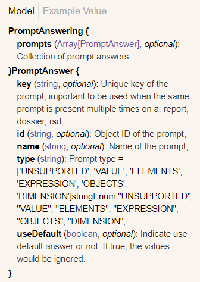
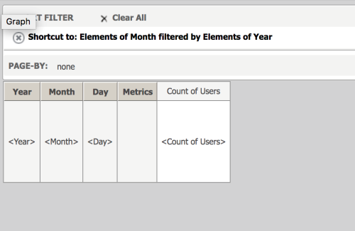
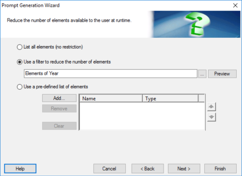
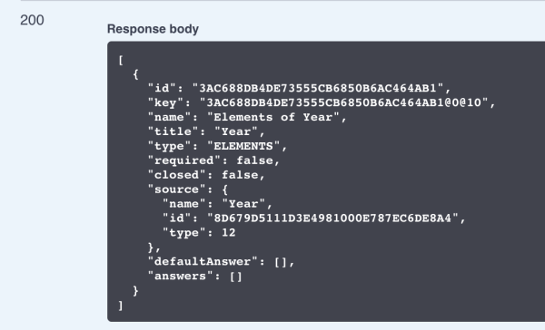
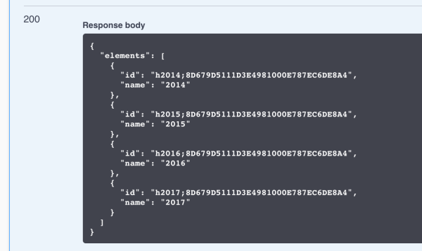
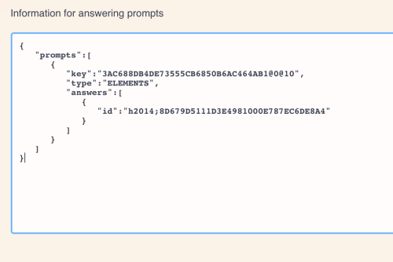
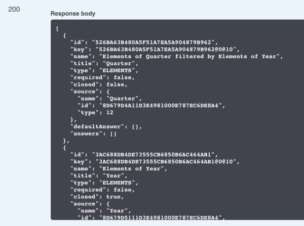
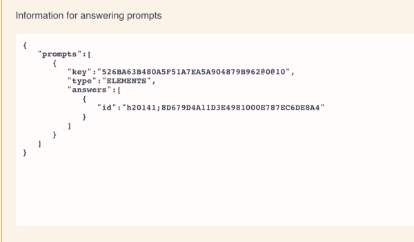

## Workflow Sample: Answer Prompts

Here is a workflow sample for using REST APIs to answer prompts:

1. [Create an instance of a dossier, document or report](#create-an-instance-of-a-dossier-document-or-report)

   Only the prompt ID, instance ID and prompt status are returned when an instance of a prompted dossier or document is created; data is not returned. This is different from prompted reports. When an instance of a prompted report is created, the prompt ID, instance ID, prompt status, and data are all returned.

   :::tip

   Data is returned for unprompted dossiers, documents, and reports.

   :::

1. [Provide prompt answers](#provide-prompt-answers)

   You can provide prompt answers for three separate prompt types: [attribute element prompts](./prompt-types/attribute-element-prompts.md), [object prompts](./prompt-types/object-prompts.md), and [value prompts](./prompt-types/value-prompts.md).

   To view the results of applying prompt answers, you need to use another REST API. While this step is not a requirement for answering prompts, it is necessary for seeing the results if you want to confirm that the prompt answers you provided were applied.

1. [Export results to PDF](#export-results-to-pdf)

   You can confirm that the prompt answers were successfully applied by exporting the results of the report or document/dossier execution to PDF.

Detailed explanations for each step are provided below:

## Create an instance of a dossier, document or report

Endpoints:

- POST `/documents/{id}/instances`

- POST `/reports/{reportId}/instances`

:::tip

You can also use POST `/dossiers/{dossierId}/instances` to create an instance of a dossier.

:::

You can execute a specific report, document, or dossier and create an instance of that report, document, or dossier. The information in the responses varies, but each response includes two important pieces of information—the instance ID and status. The instance ID is “mid” for a dossier or document and "instanceId" for a report. Status "1" indicates that the instance has been created, and status "2" indicates that the dossier, document or report is waiting for a prompt answer. If the status is "1", the response also returns the ID of the object.

The response body when you create an instance of a prompted document or dossier would look like the following sample code:

```json
{
  "id": "0034EC8011E70F1600000080EFD5150B",

  "status": 2,

  "mid": "F160BAF211E8C0372DBC0080EFE59EDF"
}
```

The response body when you create an instance of a prompted report would look like the following sample code:

```json
{
  "id": "0034EC8011E70F1600000080EFD5150B",

  "instanceId": "F160BAF211E8C0372DBC0080EFE59EDF",

  "status": 2
}
```

## Provide prompt answers

Endpoints:

- PUT `/documents/{id}/instances/{instanceId}/prompts/answers`

- PUT `/reports/{reportId}/instances/{instanceId}/prompts/answers`

You can provide prompt answers for three separate prompt types: attribute element prompts, object prompts, and value prompts. Sample JSON for each prompt answer is provided below. The request returns an HTTP status code of 204.

```json
{
  "answers": [
    {
      "key": "W34D600FCA9CE481F89859762AED04C69",

      "type": "OBJECTS", //object prompts

      "answers": [
        {
          "id": "8D679D4111D3E4981000E787EC6DE8A4",

          "type": 12
        },
        {
          "id": "8D679D4111D3E4981000E787EC6DE8A4",

          "type": 12
        }
      ]
    },
    {
      "key": "W34D600FCA9CE481F89859762AED04C69",

      "type": "ELEMENTS", //attribute element prompts

      "answers": [
        {
          "id": "h4;8D679D4111D3E4981000E787EC6DE8A4;40K-50K"
        }
      ]
    },
    {
      "key": "W34D600FCA9CE481F89859762AED04C68",

      "type": "VALUE", //value prompts

      "answers": ["abc", "dfg"]
    }
  ]
}
```

## Export results to PDF

Endpoint: POST `/documents/{id}/instances/{instanceId}/pdf`

This endpoint allows the caller to export the document to a PDF file (in the form of binary data with Base64 encoding) using the instance ID and object ID of the document. Exporting to PDF is not a required part of the prompt workflow, but it is useful for confirming that the prompts have been applied correctly.

## Answer Prompts with Specific Answers

You can use REST APIs to provide prompt answers for three types of prompts applied to dossiers, documents, and reports. For these three prompt types, you can provide specific answers to prompts, choose to [use default prompt answers](#use-default-prompt-answers), or [close optional prompts without providing answers](#close-prompts-without-answers). You can also reset the status so that the dossier, document, or report will be re-prompted the next time it is run.

The prompts supported in the MicroStrategy platform are defined in [EnumDSSXMLPromptType.](https://www2.microstrategy.com/producthelp/2021/WebAPIReference/com/microstrategy/webapi/EnumDSSXMLPromptType.html)

You use the following REST API endpoints to answer a prompt applied to a dossier, document, or report:

- PUT `/documents/{id}/instances/{instanceId}/prompts/answers`

- PUT `/reports/{reportId}/instances/{instanceId}/prompts/answers`

You can use REST APIs to answer the following three prompt types:

- [Attribute Element Prompts](./prompt-types/attribute-element-prompts.md)
- [Object prompts](./prompt-types/object-prompts.md)
- [Value prompts](./prompt-types/value-prompts.md)

You can identify prompts with the prompt key, prompt ID, or prompt name. If more than one identifier is provided, the logic for identifying the prompt will follow this order: key, ID, name. The prompt key is used first if is available because the key is the only unique value. Since the same prompt can be applied more than once to a dataset, the ID and the name might not be unique. Despite this possibility, the name is often the most convenient way to identify a prompt because of its descriptive nature.

## Use Default Prompt Answers

You use the following REST API endpoints to answer a prompt with the default prompt answers:

- PUT `/documents/{id}/instances/{instanceId}/prompts/answers`

- PUT `/reports/{reportId}/instances/{instanceId}/prompts/answers`

You can answer the following prompts with default answers:

- [Attribute Element Prompts](./prompt-types/attribute-element-prompts.md)
- [Object prompts](./prompt-types/object-prompts.md)
- [Value prompts](./prompt-types/value-prompts.md)

In the body parameter of the request, you use the `id`, `key`, or `name` parameter to identify the prompt and the type parameter to specify the prompt type. You specify that the default prompt answers should be used by setting the `useDefault` parameter to "true". The default answers that were stored with the prompt are applied at runtime.



Sample code for answering several types of prompts with the default answer, with the prompt identified by ID.

```json
{
  "prompts": [
    {
      "id": "055A4B7241396EB7FC27E3A5D2A9FB2F", //element prompt

      "useDefault": true
    },
    {
      "id": "0B524DB54440D0280747C1A3058ED474", //object prompt

      "useDefault": true
    },
    {
      "id": "0CE45CA4483E29FFB0AF969D68588E95", //value prompt

      "useDefault": true
    }
  ]
}
```

## Close Prompts without Answers

You close a prompt by using a REST API to answer the prompt, but not providing an answer. You can call one of the following REST API endpoints to close a prompt:

- PUT `/documents/{id}/instances/{instanceId}/prompts/answers`

- PUT `/reports/{reportId}/instances/{instanceId}/prompts/answers`

The prompts you close must all be optional; if you try to close a required prompt, you will get an error.

You can close the following prompts by not providing answers:

- [Attribute element prompts](./prompt-types/attribute-element-prompts.md)
- [Object prompts](./prompt-types/object-prompts.md)
- [Value prompts](./prompt-types/value-prompts.md)

In the body parameter of the request, you use the `id`, `key`, or `name` parameter to identify the prompt and the type parameter to specify the prompt type. For the parameters where you would have provided a prompt answer, you leave the value blank.

## Reprompt

You can use a REST API to cause a prompted document or dossier to be re-prompted. You cannot currently use a REST API to specifically reprompt a report.

## Nested Prompts

It is possible that the report, dossier, or document contains nested prompts which need to be resolved prior to fetching data. These prompts can be nested _n_ levels deep, so this workflow may need to be iterated over.

Let's see an example report with the following template:



In the report filter there is an attribute element prompt on Quarter that is configured to use a filter on Year to reduce the number of elements.



When this report is executed, the user is prompted to select the year and then quarter, which is filtered based on the year selection.

To achieve this workflow via REST API, you simply need to loop through the following workflow:

1. Execute the report using POST `/v2/reports/{id}/instances`.

   There is a response with an HTTP status of 200. Inside the body, status=2, which means there are prompts to be answered.

   

1. Fetch the current open prompts using GET `/reports/{id}/instances/{instanceId}/prompts`.

   There is a response with an HTTP status of 200. One prompt is in the body.

   

1. Fetch potential elements for prompt answering using GET `/reports/{id}/instances/{instanceId}/prompts/{id}/elements`.

   There is a response with an HTTP status of 200 and a list of elements.

   

1. Answer the prompt using PUT `/reports/{id}/instances/{instancedId}/prompts/answers`.

   Request Body:

   

   HTTP Response Status: 204

1. Check the status of report/fetch data using GET `/v2/reports/{id}/instances/{instanceId}`.

   There is a response of 200. The status within the body is still 2, which means there are still unanswered prompts.

   

1. Fetch the current open prompts using GET `/reports/{id}/instances/{instanceId}/prompts`.

   There is a response of 200 with two prompts. One prompt is closed=true, since it was already answered. If you call the GET /api/prompts API with a closed=true query parameter, the answered prompt is filtered out.

   

1. Fetch potential elements for prompt answering using GET `/reports/{id}/instances/{instanceId}/prompts/{id}/elements`.

   There is a response of 200 with a list of elements for Quarter, which is filtered based on the prompt answer used for Year.

   

1. Answer the prompt using PUT `/reports/{id}/instances/{instancedId}/prompts/answers`.

   Request Body:

   

1. Check the status of report/fetch data using GET `/v2/reports/{id}/instances/{instanceId}`.

There is a response of 200. The response body now contains the data, since all prompts have been answered.

### Documents and Dossiers

To reprompt a document or dossier, use the following endpoint:

- POST `/documents/{id}/instances/{instanceId}/rePrompt`

This sets the status back to "1", indicating that the document or dossier is waiting for prompt answers.

When you use this endpoint, a new instance ID is generated, different from the one passed in the request. Having separate instance IDs for before and after the re-prompting request is designed to allow users to go back if they decide they want to revert to the previous instance.

### Reports

To reprompt a report, simply execute the prompted report again, using the same endpoint you used originally.

- PUT `/reports/{reportId}/instances/{instanceId}/prompts/answers`
